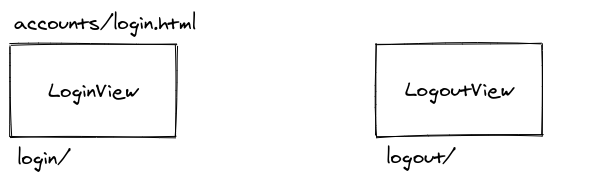

# Guia de autenticação com Django

## Este projeto foi feito com:

* [Python 3.8.2](https://www.python.org/)
* [Django 3.1.8](https://www.djangoproject.com/)
* [Bootstrap 4.0](https://getbootstrap.com/)

## Como rodar o projeto?

* Clone esse repositório.
* Crie um virtualenv com Python 3.
* Ative o virtualenv.
* Instale as dependências.
* Rode as migrações.

```
git clone https://github.com/rg3915/django-auth-tutorial.git
cd django-auth-tutorial
python3 -m venv .venv
source .venv/bin/activate
pip install -r requirements.txt
python contrib/env_gen.py
python manage.py migrate
python manage.py createsuperuser --username='admin' --email=''
```

### Configurar settings.py

```python
INSTALLED_APPS = [
    'myproject.accounts',  # <---
    'django.contrib.admin',
    'django.contrib.auth',
    ...
    'django_extensions',
    'widget_tweaks',
    'myproject.core',
]

LOGIN_URL = 'login'
LOGIN_REDIRECT_URL = 'core:index'
LOGOUT_REDIRECT_URL = 'core:index'
```

Leia o [passo-a-passo.md](passo-a-passo.md).


## Estrutura

### Login



### Cadastro


### Trocar senha


### Esqueci minha senha


## Telas

### Login


### Cadastro


### Trocar senha


### Esqueci minha senha


## MailHog

Rodar [MailHog](https://github.com/mailhog/MailHog) via Docker.

```
docker run -d -p 1025:1025 -p 8025:8025 mailhog/mailhog
```

### Configurar settings.py

```python
EMAIL_BACKEND = 'django.core.mail.backends.smtp.EmailBackend'

DEFAULT_FROM_EMAIL = config('DEFAULT_FROM_EMAIL', 'webmaster@localhost')
EMAIL_HOST = config('EMAIL_HOST', '0.0.0.0')  # localhost
EMAIL_PORT = config('EMAIL_PORT', 1025, cast=int)
EMAIL_HOST_USER = config('EMAIL_HOST_USER', '')
EMAIL_HOST_PASSWORD = config('EMAIL_HOST_PASSWORD', '')
EMAIL_USE_TLS = config('EMAIL_USE_TLS', default=False, cast=bool)
```


## Links

https://docs.djangoproject.com/en/3.1/topics/auth/default/#module-django.contrib.auth.views

https://simpleisbetterthancomplex.com/tutorial/2016/09/19/how-to-create-password-reset-view.html

https://simpleisbetterthancomplex.com/tutorial/2017/02/18/how-to-create-user-sign-up-view.html

https://simpleisbetterthancomplex.com/tips/2016/08/04/django-tip-9-password-change-form.html

https://github.com/egorsmkv/simple-django-login-and-register

https://github.com/Antonio-Neves/Custom-User-Django-pt

https://github.com/django/django/tree/main/django/contrib/admin/templates/registration

https://github.com/django/django/blob/main/django/contrib/auth/views.py

https://github.com/django/django/blob/main/django/contrib/auth/forms.py

https://github.com/django/django/blob/main/django/contrib/auth/tokens.py
